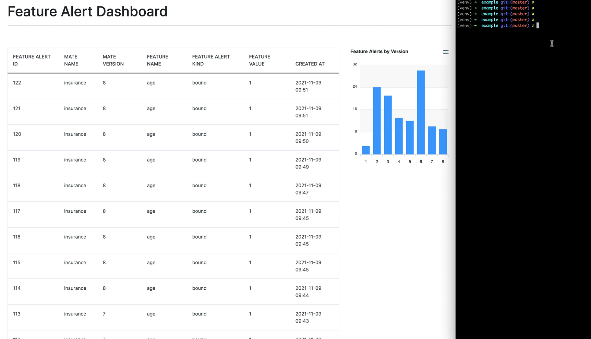

# Running Mate

[](https://badge.fury.io/py/running-mate)
[](https://github.com/mjhea0/running-mate/actions/workflows/main.yml)


Version and monitor your models, record inferences, and send alerts without any additional infrastructure. Designed for small data science or machine learning teams lacking a full MLOps solution.

Training:

1. Create local SQLite database
1. Version model
1. Generate baseline stats

Inference:

1. Check features against baseline stats
1. Create and send alerts

## Getting Started

Install:

```sh
$ pip install running-mate
```

Running Mate stores data in a local SQLite database. Start by creating the database, creating a new Mate (which represent your AI/ML model), and generate the baseline statistics:

```python
from mate.db import connect_db, version_or_create_mate
from mate.generators import generate_baseline_stats


connect_db()
mate = version_or_create_mate("mate-name")
generate_baseline_stats(your_dataframe, "mate-name")
```

This ideally happens at training time.

Then, in your serving environment, define the alert targets, get the current Mate version, load the model, wrap you model prediction in the `mate` context manager:


```python
from mate.alerts import TerminalAlertTarget
from mate.db import connect_db, get_current_mate
from mate.run import RunningMate


alert_targets = [
    TerminalAlertTarget(),
]

connect_db()
version = get_current_mate("mate-name").version

model = load(f"models/mate-name-{version}.joblib")

with RunningMate("mate-name", version, your_dataframe, alert_targets):
    model.predict(enc.transform(your_dataframe))
```

By default, not all feature values are recorded. To record all values, set `should_save_all_feature_values` to `True`:

```python
with RunningMate("mate-name", version, your_dataframe, alert_targets, should_save_all_feature_values=True):
    model.predict(enc.transform(df))
```

You can generate a summary stats report like so:

```python
from mate.generators import generate_baseline_stats

print(generate_feature_stats_summary_report("mate-name"))
```

## Examples

The basic example project, found in "examples/basic", uses `TerminalAlertTarget`, for outputting alerts to the terminal, and `AlertWebhookTarget`, for sending alerts to `http://localhost:5000/hook`.

Create/activate a virtual environment and install the dependencies:

```sh
$ cd example/basic

$ python3 -m venv venv
$ source venv/bin/activate

$ pip install -r requirements.txt
```

In one terminal window, run the web server:

```sh
$ cd web

$ FLASK_DEBUG=1 python -m flask run
```

Then, train the model and run an inference through it in a different window:

```sh
$ python train.py
$ python infer.py
```

Navigate to [http://localhost:5000](http://localhost:5000) to see the alert.



There's also a drift example in *examples/drift*.

## Development

After cloning down the repo, create/activate a virtual environment and install the dependencies:

```sh
$ python3 -m venv venv
$ source venv/bin/activate

(venv)$ pip install -r requirements-dev.txt
```

Install as local package:

```sh
(venv)$ pip install -e .
```

Run tests:

```sh
(venv)$ python -m pytest .
```

Lint, format code, and type check:

```sh
(venv)$ python -m flake8 --ignore=E501,W503 mate tests examples

(venv)$ python -m black mate tests examples

(venv)$ python -m isort --profile black mate tests examples

(venv)$ python -m mypy mate tests examples
```
