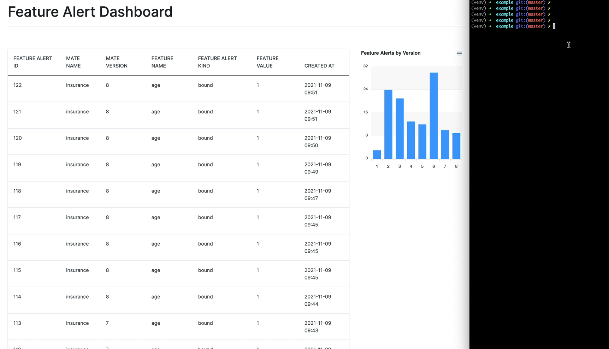

# Running Mate

Version and monitor your models, record inferences, and send alerts without any additional infrastructure. Designed for small data science or machine learning teams lacking a full MLOps solution.

Training:

1. Create local SQLite DB
1. Version model
1. Generate baseline stats

Inference:

1. Check features against baseline stats
1. Create and send alerts

## Getting Started

After cloning down the repo, create/activate a virtual environment and install the dependencies:

```sh
$ python3 -m venv venv
$ source venv/bin/activate

$ pip install -r requirements.txt
```

Install as local package:

```sh
$ pip install -e .
```

## Example

The example project uses `TerminalAlertTarget`, for outputting alerts to the terminal, and `AlertWebhookTarget`, for sending alerts to `http://localhost:5000/hook`.

Create/activate a virtual environment and install the dependencies:

```sh
$ cd example

$ python3 -m venv venv
$ source venv/bin/activate

$ pip install -r requirements.txt
```

In one terminal window, run the web server:

```sh
$ cd web

$ FLASK_DEBUG=1 python -m flask run
```

Then, train the model and run an inference through it in a different window:

```sh
$ python train.py
$ python infer.py
```

Navigate to [http://localhost:5000](http://localhost:5000) to see the alert.



## Development

After cloning down the repo, create/activate a virtual environment and install the dependencies:

```sh
$ python3 -m venv venv
$ source venv/bin/activate

$ pip install -r requirements-dev.txt
```

Install as local package:

```sh
$ pip install -e .
```

Run tests:

```sh
$ pytest .
```

Lint, format code, and type check:

```sh
$ flake8 --ignore=E501,W503 mate tests example

$ black mate tests example

$ isort --profile black mate tests example

$ mypy mate tests example
```

## TODO

1. optionally send runtime stats (like latency)
1. add more tests
1. add ability to pass in custom, user-defined stats
